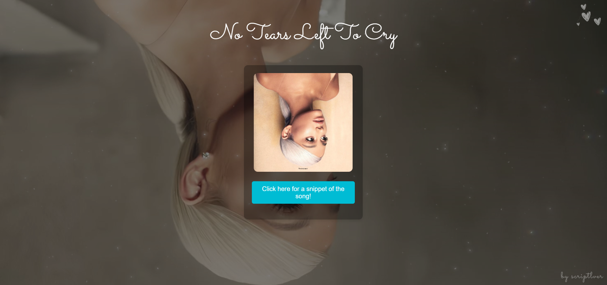
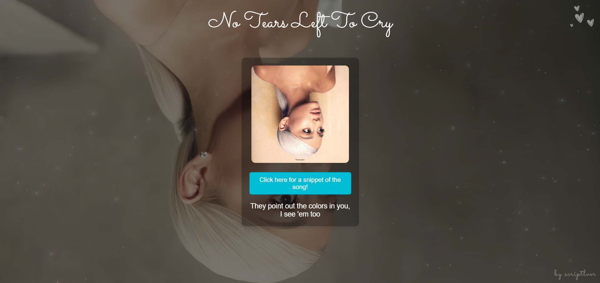

 # no tears left to cry website 💗

hiii everyone! 💗

i present my simple website, developed with **html**, **css**, and **python** (for the backend)! 💗 this project is all about **ariana grande's song _no tears left to cry_**, allowing users to interact with a button that shows snippets of the song.

## 🎶 features

✨ **on the site, you'll find:**
- 💗 a button that shows snippets of the song
- 💗 an interactive experience to engage with the music
- 💗 a clean, aesthetic design inspired by the song's vibe

## 🌟 about the project
this was a great project for me to practice my **web development** skills and explore the integration of **html**, **css**, and **python**. i had so much fun creating it and hope you enjoy the experience! 💗

## 🚀 technologies used
- html
- css
- python (backend)

## 📸 preview

## 📌 how to access
you can check out the project by visiting: https://scriptlver.github.io/no-tears-left-to-cry-site

## 💗 contributing
feel free to open issues or pull requests if you have any suggestions or improvements!

## 📜 license
this project is for educational and entertainment purposes only.
